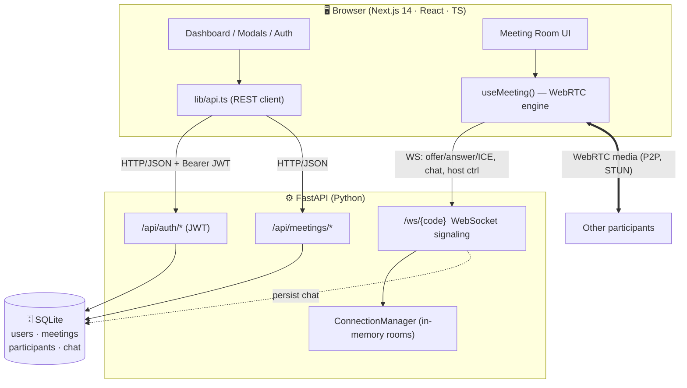
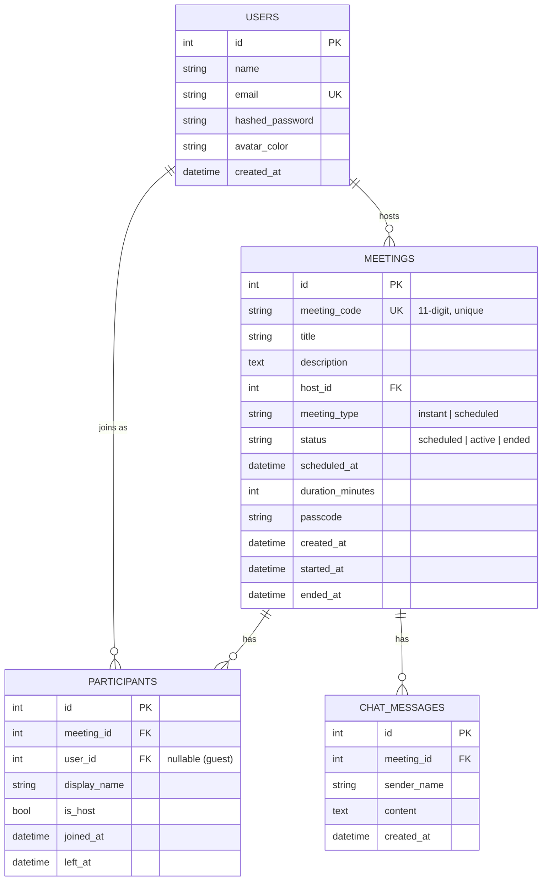
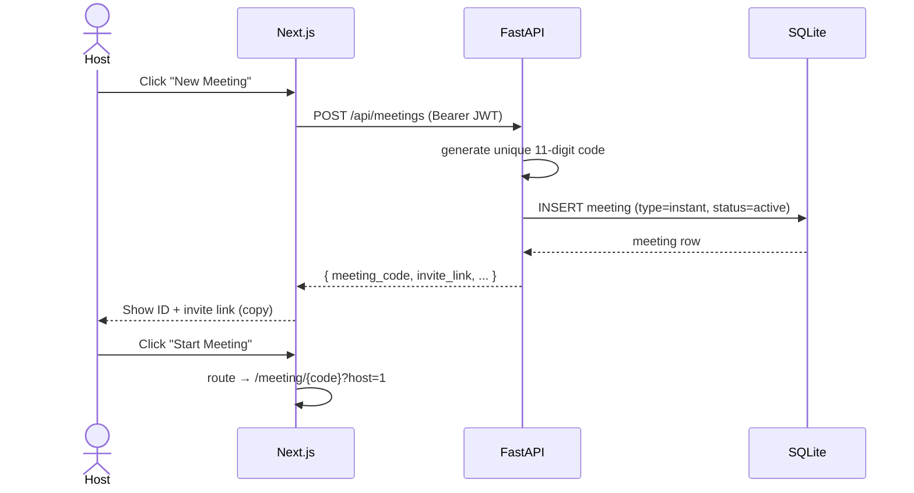
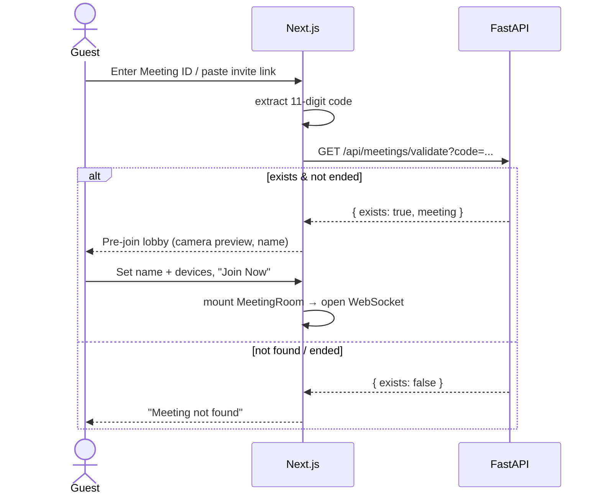
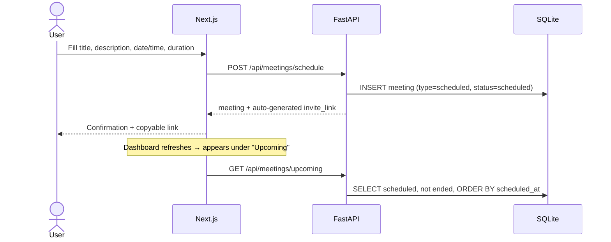
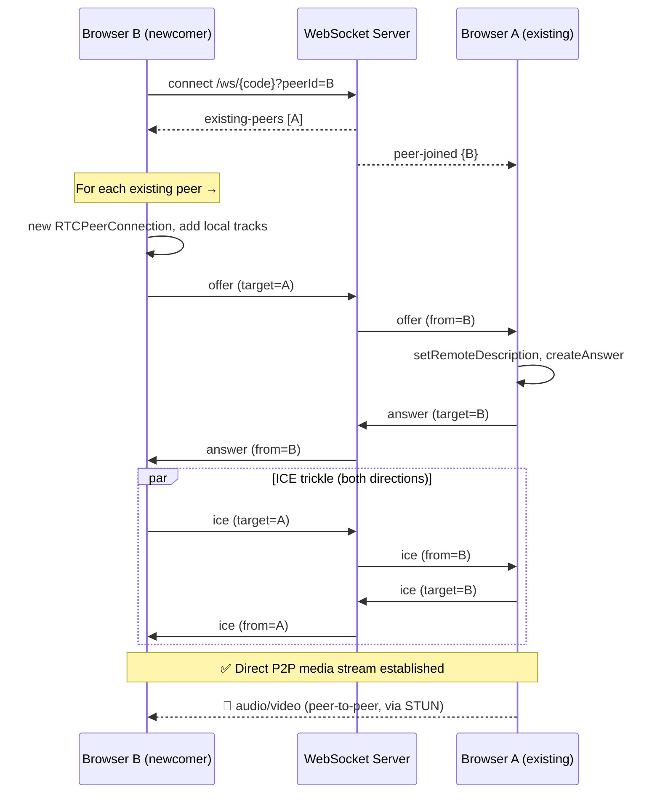
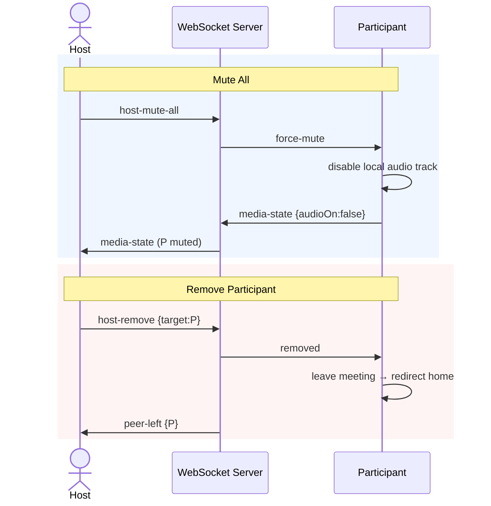
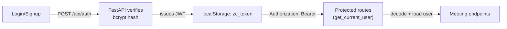

# Architecture & Workflow

This document explains how the Zoom Clone is put together — the system
topology, the database design, and the end-to-end workflows for every core
feature. All diagrams are [Mermaid](https://mermaid.js.org/) and render
directly on GitHub.

---

## 1. System Overview

Three tiers: a Next.js **client**, a FastAPI **server**, and a SQLite
**database**. The client talks to the server over two channels — plain **HTTP
(REST)** for CRUD, and a **WebSocket** for real-time signaling. Actual audio/video
never touches the server: it flows **peer-to-peer** over WebRTC.

**Key idea:** the WebSocket server is only a *signaling relay + presence
tracker*. Once two browsers have exchanged SDP offers/answers and ICE
candidates through it, media streams directly between them.

---

## 2. Database Design

A normalized relational schema with four tables and clear ownership.

**Design decisions**
- `meeting_code` is the public identifier (unique, indexed); the integer `id`
  is the internal PK. This keeps public URLs opaque and DB joins fast.
- `meeting_type` vs `status` are separate axes: *type* is fixed at creation
  (instant/scheduled), *status* changes over the lifecycle (scheduled → active → ended).
- `participants.user_id` is nullable so **guests** (join by link without an
  account) are supported while still recording named attendance.
- Cascade deletes (`Meeting → Participants/Chat`) keep the DB consistent.

---

## 3. Core Workflows

### 3.1 Instant Meeting

### 3.2 Join Meeting (by ID or link)

### 3.3 Schedule Meeting

---

## 4. Real-Time Meeting: WebRTC + Signaling

The most involved part. When a user joins, `useMeeting()` acquires local media
and opens a WebSocket. The server tells the newcomer who is already present; the
newcomer initiates a peer connection to each. Classic **mesh** topology.

**Message protocol** (JSON over the WebSocket):

| Direction | `type` | Purpose |
| --- | --- | --- |
| C→S | `offer` / `answer` / `ice` | 1:1 WebRTC negotiation (relayed to `target`) |
| C→S | `chat` | Broadcast message (also persisted) |
| C→S | `media-state` | Broadcast mic/cam on/off |
| C→S | `host-mute-all` | Host asks everyone to mute |
| C→S | `host-remove` | Host removes a participant |
| S→C | `existing-peers` / `peer-joined` / `peer-left` | Presence |
| S→C | `force-mute` / `removed` | Host-control effects |

### 4.1 Host Controls

Host authority is enforced **server-side**: `ws_manager` only honours
`host-mute-all` / `host-remove` when the sending peer connected with `host=true`.

---

## 5. Request Lifecycle & Auth

- Passwords hashed with **bcrypt**; never stored or returned in plaintext.
- JWT (HS256) carries the user id (`sub`), 7-day expiry.
- `AuthProvider` (React context) restores the session on load via `/api/auth/me`
  and guards the dashboard, redirecting to `/login` when unauthenticated.

---

## 6. Frontend Module Responsibilities

| Module | Responsibility |
| --- | --- |
| `app/page.tsx` | Dashboard: greeting, action tiles, upcoming/recent lists |
| `app/meeting/[id]/page.tsx` | Validate → pre-join lobby → mount room |
| `lib/api.ts` | Typed REST client, token storage, error normalisation |
| `lib/auth.tsx` | Auth context (login/signup/logout/session restore) |
| `lib/useMeeting.ts` | **WebRTC engine**: media, peer connections, signaling, chat, host controls, screen share |
| `components/modals/*` | New / Join / Schedule dialogs |
| `components/meeting/*` | VideoGrid, VideoTile, ControlBar, Participants, Chat, PreJoin, MeetingRoom |

Separation of concerns: **network/logic** lives in `lib/`, **presentation** in
`components/`, **routing/orchestration** in `app/`. Components are stateless
where possible and driven by props from the `useMeeting` hook.

---

## 7. Scaling Notes (beyond the assignment)

- **TURN server**: mesh + STUN works for most cases; add a TURN relay for peers
  behind symmetric NATs/strict firewalls.
- **SFU** (e.g. mediasoup/LiveKit): mesh is O(n²) connections. For meetings
  larger than ~6–8 participants, route media through a Selective Forwarding Unit
  so each client uploads once.
- **Database**: swap SQLite for Postgres via `DATABASE_URL`; the SQLAlchemy layer
  is unchanged.
- **Signaling presence**: move `ConnectionManager` state to Redis pub/sub to run
  multiple backend instances behind a load balancer.
- **Recording / transcription** would hook into the SFU media path.
