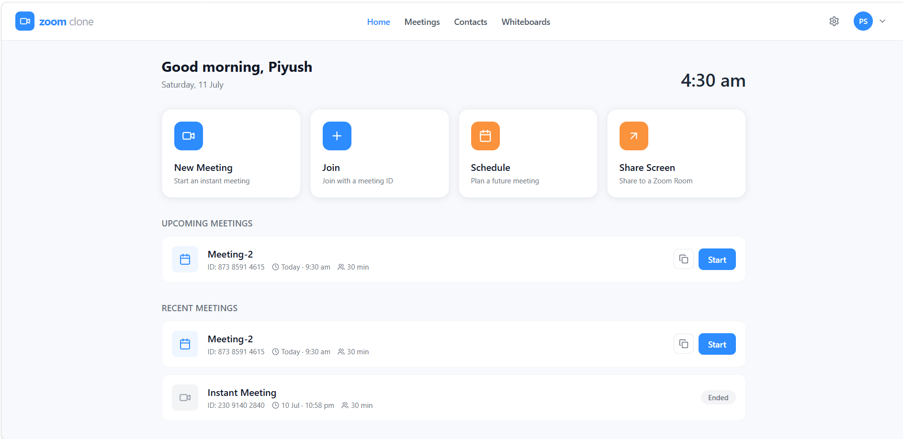
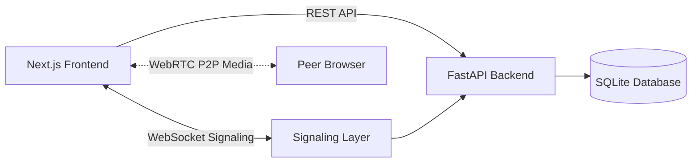
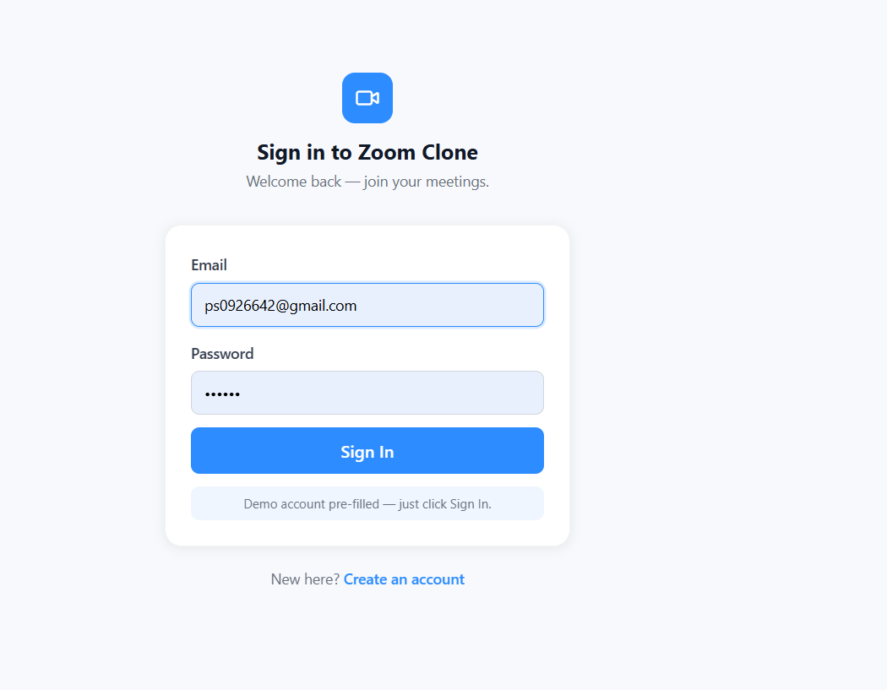
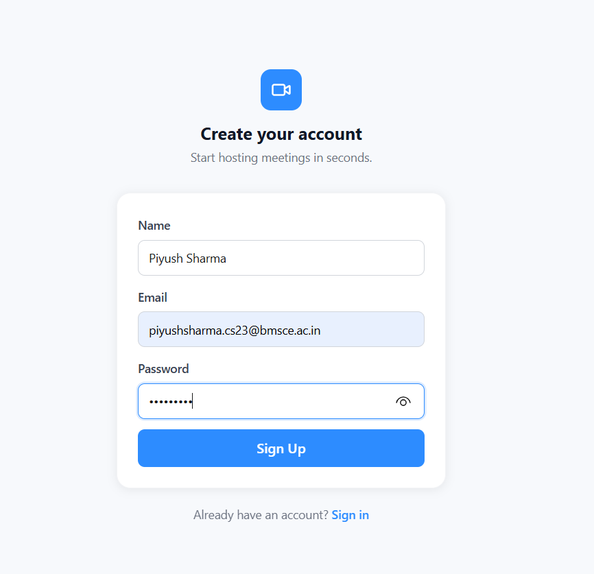
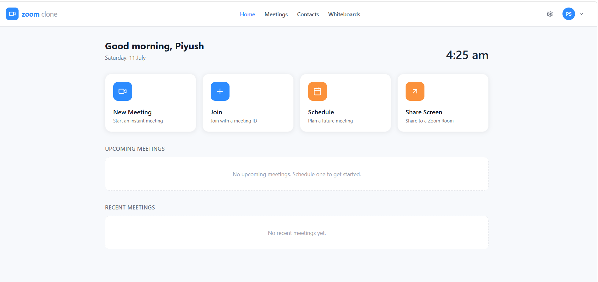
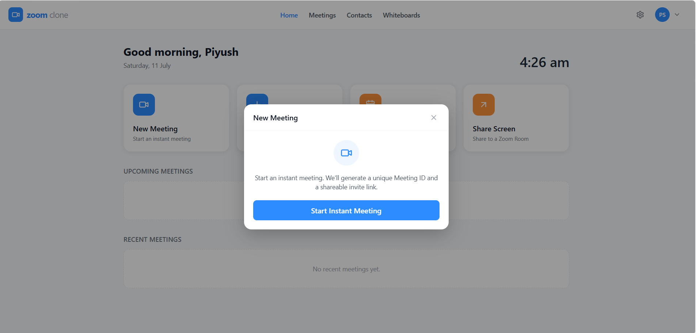
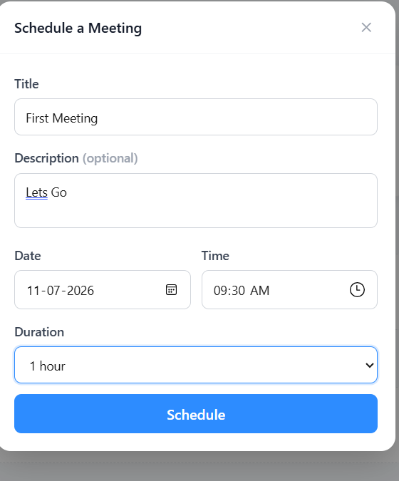
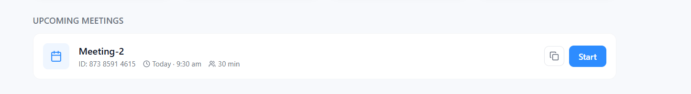
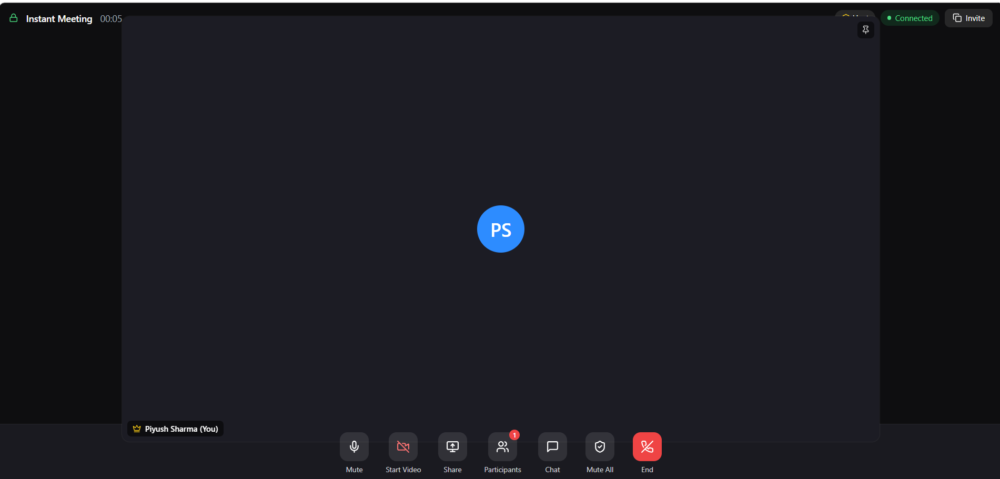
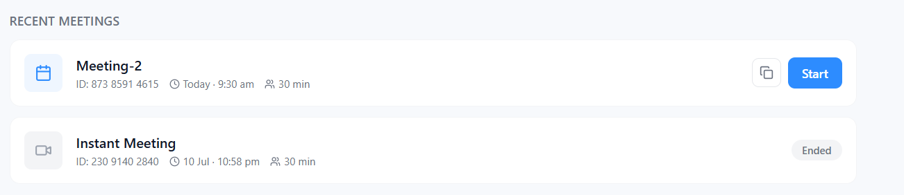

<div align="center">


# 🎥 Zoom Clone

### A Full-Stack, Production-Deployed Video Conferencing Platform

Real-time video calls, live signaling, and meeting management — built with **Next.js**, **FastAPI**, **WebRTC** and **WebSockets**.

**[🚀 Live App](https://zoom-clone-teal-five.vercel.app)** &nbsp;·&nbsp; **[⚙️ Backend API](https://zoom-clone-0e5k.onrender.com)** &nbsp;·&nbsp; **[📘 API Docs](https://zoom-clone-0e5k.onrender.com/docs)**

</div>

<br/>



<br/>

## 📑 Table of Contents

- [About the Project](#about-the-project)
- [Key Features](#key-features)
- [System Architecture](#system-architecture)
- [Tech Stack](#tech-stack)
- [Screenshots](#screenshots)
- [Project Structure](#project-structure)
- [API Reference](#api-reference)
- [Getting Started](#getting-started)
- [Environment Variables](#environment-variables)
- [Security](#security)
- [Roadmap](#roadmap)
- [Contributing](#contributing)
- [Author](#author)
- [License](#license)

<br/>

<a name="about-the-project"></a>

## 📖 About the Project

**Zoom Clone** is a full-stack video conferencing platform that recreates the core experience of tools like Zoom and Google Meet, built entirely from scratch and deployed end-to-end. It covers the full slice of a real-time product: a secure REST API for accounts and meetings, a WebSocket layer for live signaling, and peer-to-peer audio/video streaming over WebRTC — all wrapped in a responsive Next.js interface.

The goal behind this project was to go deep on real-time web architecture: how independent pieces — authentication, persistence, signaling, and peer connections — come together into one coherent, production-deployed application rather than a local-only demo.

**What you can do in the app:**

- Create an account and sign in securely
- Start an instant meeting, or schedule one for later
- Join a meeting by ID or shareable invite link
- Talk face-to-face over a live WebRTC video/audio connection
- Track upcoming meetings and past meeting history from a central dashboard

<br/>

<a name="key-features"></a>

## ✨ Key Features

### 🔐 Authentication & Account Security

- Email/password signup with server-side validation
- Login issues a short-lived **JWT access token**, used to authorize every subsequent request
- Passwords are hashed with **BCrypt** — plaintext passwords are never stored
- Protected routes on both ends: the frontend redirects unauthenticated users, and the backend guards routes with dependency-injected auth checks
- `GET /api/auth/me` returns the current session's profile, so the UI always knows who's logged in

### 🎥 Instant & Scheduled Meetings

- Start a meeting instantly — the backend generates a unique meeting ID and the host is dropped straight into the room
- Or schedule a meeting for later with a title, date, and time; it surfaces under "Upcoming Meetings" on the dashboard until it's time to join

### 🔗 Join via Meeting ID or Invite Link

- Anyone with the meeting ID or a shared invite link can join directly — no separate onboarding flow needed beyond a normal login

### 📹 Real-Time Video & Audio (WebRTC)

- Camera and microphone access is requested and managed directly in the call UI
- Audio/video streams flow **peer-to-peer** between participants' browsers once the connection is negotiated, keeping latency low and taking load off the server

### 🔌 Live Signaling (WebSockets)

- A persistent WebSocket connection is what makes the video calls possible in the first place — it carries the offer/answer/ICE-candidate exchange that WebRTC needs to establish a peer connection
- The same channel powers presence, so participants can see who's joined or left the room in real time

### 🖥️ Dashboard & Meeting History

- A central dashboard summarizing recent meetings, upcoming scheduled ones, and quick actions (New Meeting / Join / Schedule)
- A full meeting history log to look back on past sessions

Screenshots are included below for the full end-to-end flow.

### 📱 Responsive, Zoom-Inspired UI

- Built with Tailwind CSS to adapt cleanly across desktop, tablet, and mobile
- UI patterns modeled after conferencing tools people already know, keeping the learning curve near zero

<br/>

<a name="system-architecture"></a>

## 🏗️ System Architecture



- **REST layer:** the Next.js frontend calls FastAPI endpoints for everything that isn't real-time — signup, login, creating/scheduling/listing meetings
- **Signaling layer:** a WebSocket connection between each client and the backend exchanges the SDP offers/answers and ICE candidates needed to set up a WebRTC session
- **Media layer:** once signaling completes, video/audio flows **directly between browsers** over WebRTC — the server is never in the media path
- **Persistence:** SQLite stores users and meeting records via SQLAlchemy models

<br/>

<a name="tech-stack"></a>

## 🛠️ Tech Stack

| Layer                | Technology                    | Purpose                                   |
| -------------------- | ----------------------------- | ----------------------------------------- |
| **Frontend**         | Next.js 14, React, TypeScript | UI framework & routing                    |
| **Styling**          | Tailwind CSS                  | Responsive, utility-first styling         |
| **Backend**          | FastAPI, Python 3.13          | REST API & WebSocket server               |
| **ORM / Validation** | SQLAlchemy, Pydantic          | Data models & request/response validation |
| **Database**         | SQLite                        | Persistent storage for users & meetings   |
| **Auth**             | JWT, BCrypt                   | Stateless auth & password hashing         |
| **Real-Time**        | WebRTC, WebSockets            | Peer-to-peer media & live signaling       |
| **Frontend Hosting** | Vercel                        | CI/CD + edge hosting for Next.js          |
| **Backend Hosting**  | Render                        | API & WebSocket server hosting            |

<br/>
<a name="screenshots"></a>

# 📸 Application Screenshots

The following screenshots showcase the complete workflow of the application—from authentication to scheduling meetings and joining live video conferences.

---

## 🏠 Application Overview


A modern, responsive dashboard providing instant access to meeting creation, scheduling, recent meetings, and productivity features.

---

## 🔐 Login Page



Secure authentication using JWT-based login. Users can quickly access their personalized dashboard after successful authentication.

---

## 📝 Sign Up Page



Create a new account securely. Passwords are hashed before storage, ensuring user credentials remain protected.

---

## 📊 Dashboard



The central dashboard provides quick access to instant meetings, scheduled meetings, meeting history, and meeting management tools through a clean and responsive interface.

---

## 🎥 Create Instant Meeting



Launch an instant video conference with a single click. Every meeting is assigned a unique meeting ID and invitation link for secure participant access.

---

## 📅 Schedule a Meeting



Plan meetings in advance by specifying the title, description, date, and time. Scheduled meetings are automatically organized for future access.

---

## 📆 Scheduled Meetings



View all upcoming scheduled meetings directly from the dashboard, making it easy to manage and join future sessions.

---

## 🎬 Live Meeting Room



Real-time meeting interface powered by WebRTC and WebSockets, supporting secure peer-to-peer video communication with live signaling.

---

## 📚 Meeting History



Access previously hosted meetings with complete meeting records, enabling users to review and manage past conferencing sessions.

---

## 🌟 Why This Project?

This project demonstrates the development of a production-ready full-stack video conferencing platform inspired by Zoom. It showcases modern web development practices including scalable backend architecture, secure authentication, real-time communication, responsive frontend design, RESTful APIs, and cloud deployment.

### Key Engineering Highlights

- 🔐 JWT Authentication & Authorization
- 🎥 Real-time Video Conferencing using WebRTC
- 🔄 WebSocket-based Signaling Server
- 📅 Meeting Scheduling System
- 👥 Instant Meeting Creation & Invitation Sharing
- 📱 Fully Responsive UI
- ⚡ FastAPI REST Backend
- 🌐 Production Deployment on Vercel & Render
- 🛡️ Secure Password Hashing using BCrypt
- 🗂️ Modular and Scalable Project Structure

<br/>

<a name="project-structure"></a>

## 📂 Project Structure

```
zoom-clone/
├── frontend/
│   ├── src/
│   │   ├── app/            # Next.js App Router pages
│   │   ├── components/     # Reusable UI components and meeting UI
│   │   ├── lib/            # API client, auth context, meeting hooks
│   │   └── types/          # Shared TypeScript types
│   ├── package.json
│   └── .env.local.example
│
├── backend/
│   ├── app/
│   │   ├── routers/        # FastAPI route handlers (auth, meetings, signaling)
│   │   ├── main.py         # FastAPI app entrypoint + CORS middleware
│   │   ├── config.py       # Environment-backed settings
│   │   ├── database.py     # SQLAlchemy engine and session
│   │   ├── models.py       # SQLAlchemy models
│   │   ├── schemas.py      # Pydantic request/response schemas
│   │   ├── auth.py         # JWT and password utilities
│   │   └── ws_manager.py   # In-memory WebSocket room manager
│   ├── requirements.txt
│   └── .env.example
│
└── README.md
```

<br/>

<a name="api-reference"></a>

## 🔌 API Reference

> Full interactive documentation (Swagger UI) is auto-generated by FastAPI at **[`/docs`](https://zoom-clone-0e5k.onrender.com/docs)**.

| Method | Endpoint                          | Description                                    | Auth Required |
| ------ | --------------------------------- | ---------------------------------------------- | ------------- |
| `POST` | `/api/auth/signup`                | Register a new user                            | ❌            |
| `POST` | `/api/auth/login`                 | Authenticate & receive a JWT                   | ❌            |
| `GET`  | `/api/auth/me`                    | Get the current user's profile                 | ✅            |
| `POST` | `/api/meetings`                   | Create an instant meeting                      | ✅            |
| `POST` | `/api/meetings/schedule`          | Schedule a meeting                             | ✅            |
| `GET`  | `/api/meetings/upcoming`          | List upcoming scheduled meetings               | ✅            |
| `GET`  | `/api/meetings/recent`            | List recent meetings                           | ✅            |
| `GET`  | `/api/meetings/all`               | List all meetings                              | ✅            |
| `GET`  | `/api/meetings/validate?code=...` | Validate meeting code                          | ❌            |
| `GET`  | `/api/meetings/{code}`            | Get a meeting by code                          | ❌            |
| `WS`   | `/ws/{code}`                      | WebSocket signaling channel for a meeting room | ❌            |

<br/>

<a name="getting-started"></a>

## ⚙️ Getting Started

### Prerequisites

- Node.js 18+
- Python 3.10+
- npm or yarn

### Backend Setup

```bash
cd backend
python -m venv venv
source venv/bin/activate   # venv\Scripts\activate on Windows
pip install -r requirements.txt
python -m app.seed
uvicorn app.main:app --reload --port 8000
```

The API runs at `http://localhost:8000`, with interactive docs at `http://localhost:8000/docs`.

### Frontend Setup

```bash
cd frontend
npm install
npm run dev
```

The app runs at `http://localhost:3000`.

<br/>

<a name="environment-variables"></a>

## 🔐 Environment Variables

**Frontend** — `.env.local`

```env
NEXT_PUBLIC_API_URL=https://zoom-clone-0e5k.onrender.com
NEXT_PUBLIC_WS_URL=wss://zoom-clone-0e5k.onrender.com
```

**Backend** — `.env`

```env
DATABASE_URL=sqlite:///./zoom_clone.db
SECRET_KEY=your-secret-key
FRONTEND_URL=https://zoom-clone-teal-five.vercel.app
CORS_ORIGINS=http://localhost:3000,http://127.0.0.1:3000,https://zoom-clone-teal-five.vercel.app
CORS_ORIGIN_REGEX=https://.*\.vercel\.app
```

> ⚠️ Never commit real `.env` files. Add `.env` and `.env.local` to `.gitignore` — the values above are placeholders only.

<br/>

<a name="security"></a>

## 🔒 Security

- **JWT-based authentication** — stateless, short-lived access tokens
- **BCrypt password hashing** — passwords are never stored in plaintext
- **Protected API routes** — sensitive endpoints require a valid token
- **CORS protection** — only the deployed frontend origin(s) are allowed to call the API
- **Environment-based secrets** — keys and connection strings are never hardcoded

<br/>

<a name="roadmap"></a>

## 🧭 Roadmap

- [ ] Meeting recording
- [ ] Waiting room / host approval
- [ ] AI-generated meeting summaries
- [ ] Calendar integration (Google Calendar sync)

<br/>

<a name="contributing"></a>

## 🤝 Contributing

Contributions are welcome!

1. Fork the repository
2. Create a feature branch (`git checkout -b feature/your-feature`)
3. Commit your changes (`git commit -m "Add your feature"`)
4. Push to the branch (`git push origin feature/your-feature`)
5. Open a Pull Request

<br/>

<a name="author"></a>

## 👨‍💻 Author

**Piyush Sharma**

[](https://github.com/PiyushSharma680)
[](https://www.linkedin.com/in/piyush-sharma-8a773a389)

<br/>

<a name="license"></a>

## 📄 License

This project is licensed under the **MIT License**.

<br/>

<div align="center">

⭐ **If you found this project interesting, consider giving it a star!**

Built with ❤️ using Next.js, FastAPI & WebRTC.

</div>
